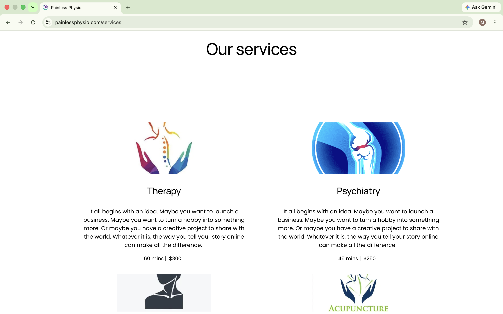
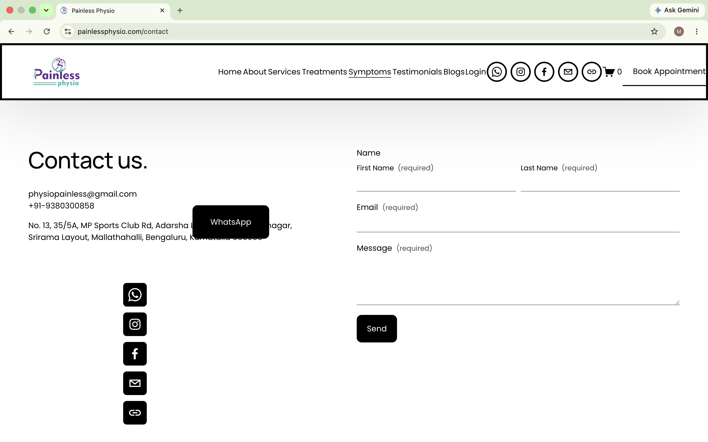

# Painless Physio - Squarespace Website

## 🌐 Live Website
https://painlessphysio.com

## 📌 Overview
Painless Physio is a professional healthcare website developed using Squarespace. The website provides information about physiotherapy services with a clean, responsive, and mobile-friendly design.

## 👨‍💻 My Role
- Website Design
- Squarespace Website Development
- Responsive Layout
- SEO Optimization
- Contact Form Setup

## 🛠️ Technologies Used
- Squarespace
- HTML
- CSS
- JavaScript

## 📷 Screenshots

### Homepage

### Services

### About

### Contact

## 📝 Note
This repository is a project showcase only. The source code is not included because the website was built using Squarespace.